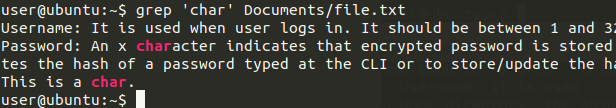
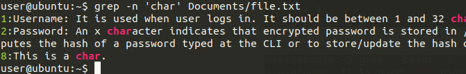
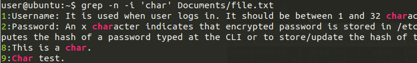
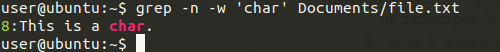
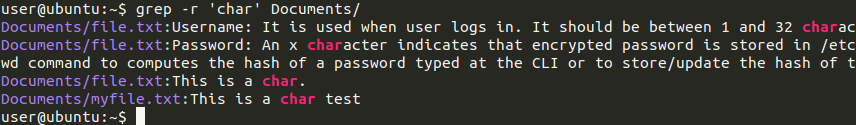

- [Basic](#basic)
  - [Search file content with grep](#search-file-content-with-grep)
  - [Sort file content using sort](#sort-file-content-using-sort)
  - [Detect duplicate lines using uniq](#detect-duplicate-lines-using-uniq)
  - [Count lines/words/chars using wc](#count-lineswordschars-using-wc)

# Basic
## Search file content with grep
`grep` is a command used to search files' contents.

Search lines that contains the string **when** in the file `Documents/file.txt` :  


Print lines numbers :  


Ignore case (uppercase, lowercase) when searching :  


Reverse search (search lines that don't contain the string **char**) :  


Search the exact word **char** in the file `Documents/file.txt` :  


Search recursively in the directory `Documents/` all files that contains the string **char** :  



## Sort file content using sort
`sort` is a command used to sort file content.

Print file content sorted alphabetically :
```console
user@ubuntu:~$ cat Documents/file2.txt 
Oh my god
Bullshit
One two three
This is a test
One two three
This is a test
user@ubuntu:~$ sort Documents/file2.txt 
Bullshit
Oh my god
One two three
One two three
This is a test
This is a test
```

Write sorted content to another file :
```console
user@ubuntu:~$ sort Documents/file2.txt -o Documents/file2_sorted.txt
```

Print file content sorted in reverse order:
```console
user@ubuntu:~$ sort -r Documents/file2.txt                             
This is a test
This is a test
One two three
One two three
Oh my god
Bullshit
```

Print file content sorted numerically:
```console
user@ubuntu:~$ cat Documents/numbers.txt 
03
4
2
01
user@ubuntu:~$ sort -n Documents/numbers.txt 
01
2
03
4
```

## Detect duplicate lines using uniq 
`uniq` is used to find repeated lines in a file.

Print file content without duplicate lines:
```console
user@ubuntu:~$ cat Documents/file2_sorted.txt 
Bullshit
Oh my god
One two three
One two three
This is a test
This is a test
user@ubuntu:~$ uniq Documents/file2_sorted.txt 
Bullshit
Oh my god
One two three
This is a test
```

Write file content without duplicates to another file:
```console
user@ubuntu:~$ uniq Documents/file2_sorted.txt  Documents/file2_sorted_uniq.txt
```

Prefix lines by the number of occurrences:
```console
user@ubuntu:~$ uniq -c Documents/file2_sorted.txt
      1 Bullshit
      1 Oh my god
      2 One two three
      2 This is a test
```

Only print duplicate lines:
```console
user@ubuntu:~$ uniq -d Documents/file2_sorted.txt
One two three
This is a test
```

## Count lines/words/chars using wc
Count number of lines in a file:
```console
user@ubuntu:~$ wc -l Documents/file2.txt 
6 Documents/file2.txt
```

`-l` can be replaced with `-w` to count number of words, or `-m` to count number of characters.

If we want to count everything at once, we can use the command `wc` without a parameter:
```console
user@ubuntu:~$ wc Documents/file2.txt
 6 18 77 Documents/file2.txt
```


<!-- 
## cut
# Advanced
## Regex searching with grep 
## sed
## awk (may be)
-->
