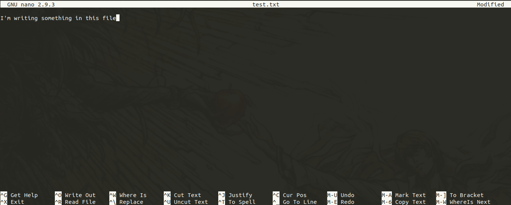

- [Basic (`nano` text editor)](#basic-nano-text-editor)
- [Advanced (`vim` text editor)](#advanced-vim-text-editor)

# Basic (`nano` text editor)
`nano` is a simple console text editor. It's really easy to use (comparing to `vim` lol).

Open a file with `nano`:
```console
user@ubuntu:~$ nano test.txt
```



We can use the shortcuts seen in the previous image to do some operations. For example :
  - `Ctrl + o` : Save the content of the file.
  - `Ctrl + x` : Save and exit.
  - `Ctrl + w` : Search for text in the current file.


# Advanced (`vim` text editor)
`vim` is a really advanced console text editor. It allows you to edit text files only using the keyboard (you don't have
to touch the mouse at all).

`vim` is not installed by default, you need to install it:
```bash
sudo apt-get install vim
```

Here is the best [tutorial](https://openclassrooms.com/fr/courses/43538-reprenez-le-controle-a-laide-de-linux/42693-vim-lediteur-de-texte-du-programmeur) for beginners to learn `vim`. Sincerely, the author of this tutorial (Mathieu Nebra) is an absolute genius, and I doubt any one can do better than him.
